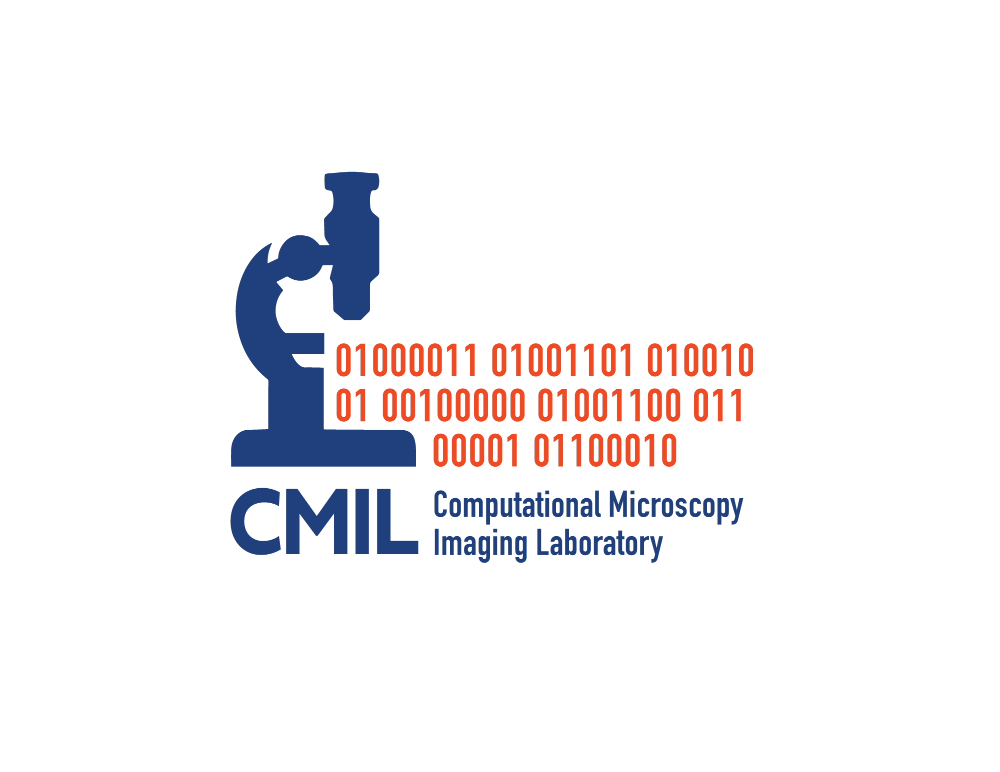
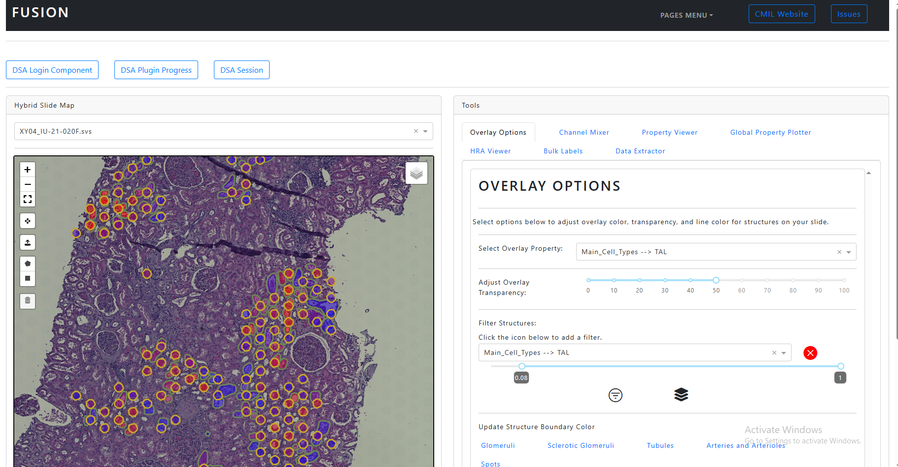

<div id="top"></div>

[![LinkedIn][linkedin-shield]][linkedin-url]


<!-- PROJECT LOGO -->
<br />
<div align="center">
  <a href="https://github.com/spborder/FUSION">
    
  </a>
  <a href="https://cmilab.nephrology.medicine.ufl.edu/">
    
  </a>

<h3 align="center">FUSION (Functional Unit State Identification in WSIs)</h3>

  <p align="center">
    AI-driven visualization and quantification of spatial OMICS
  </p>
</div>


<!-- TABLE OF CONTENTS -->
<details>
  <summary>Table of Contents</summary>
  <ol>
    <li>
      <a href="#about-the-project">About The Project</a>
      <ul>
        <li><a href="#built-with">Built With</a></li>
      </ul>
    </li>
    <li><a href="#contributing">Contributing</a></li>
    <li><a href="#license">License</a></li>
    <li><a href="#contact">Contact</a></li>
  </ol>
</details>


<!-- ABOUT THE PROJECT -->
## About The Project
<br />
<div align="center">
  <a href="https://github.com/spborder/FUSION">
    
  </a>

<h3 align="center">FUSION</h3>

  <p align="center">
    FUSION is an interactive interface to view spatial transcriptomics data integrated with histopathology. This is driven by artificial intelligence (AI). AI segments Functional Tissue Units (FTU) and links these with gene expression data that informs on major and minor healthy and injured cell types directly mapped on histological features in the WSI.
  </p>
</div>

<p align="right">(<a href="#top">back to top</a>)</p>


### Built With

* [fusion-tools](https://github.com/spborder/fusion-tools/)
* [Digital Slide Archive](https://digitalslidearchive.github.io/digital_slide_archive/)
* [Dash](https://dash.plotly.com)
* [Dash-Leaflet](https://dash-leaflet.com)

In collaboration with:
* [Human Biomolecular Atlas Project (HuBMAP)](https://hubmapconsortium.org)
* [Kidney Precision Medicine Project (KPMP)](https://kpmp.org)

<p align="right">(<a href="#top">back to top</a>)</p>


## Running from source:

### Step 1: *Digital Slide Archive (DSA)*
*FUSION* is run in conjunction with a running instance of [Digital Slide Archive (DSA)](https://github.com/DigitalSlideArchive/digital_slide_archive). For more information on how to initialize DSA, see [here](https://github.com/DigitalSlideArchive/digital_slide_archive/tree/master/devops/dsa).

Create a user "fusionguest" either through the UI tools or through the included WebAPI.


### Step 2: *FUSION Set Up*
- Start by cloning the Github repo:

```bash
$ gh repo clone spborder/FUSION 
```

- Create a virtual environment and install packages in *requirements.txt*

```bash
$(venv_name) ~/ python -m pip install -r requirements.txt
```

- For setting up linkage to a *DSA* instance, either set environment variables or modify the *FUSION.py* script to refer to the API URL, username, and password for guest users.

*Windows*
```bash
$(venv_name) ~/ $Env:DSA_USER="fusionguest"
$(venv_name) ~/ $Env:DSA_PWORD="guestpassword"
$(venv_name) ~/ $Env:DSA_URL="http://dsa_url:8080/api/v1" 
```

*Linux*
```bash
$(venv_name) ~/ export DSA_USER="fusionguest"
$(venv_name) ~/ export DSA_PWORD="guestpassword"
$(venv_name) ~/ export DSA_URL="http://dsa_url:8080/api/v1"
```

- Add the recommended plugins to your *DSA* instance. Note: This must be done using login for an admin-privileged account.
```bash
$(venv_name) ~/ python install_plugins.py
```

- Now you're good to go! Start up *FUSION* by running the main script:

```bash
$(venv_name) ~/ python FUSION.py
```

Then open a browser to [http://localhost:8000](http://localhost:8000) to view the running instance.

## Running from *Docker*:
See the included Dockerfile (*Dockerfile.dockerfile*) and modify as needed to point to your preferred instance of *DSA*.


<!-- GETTING STARTED -->
## Release History:
- 05/16/2025:
    ### Major updates:
    - Navigating *FUSION* to using components from *fusion-tools*

- 05/02/2024:
    ### Major updates:
    - Progress bars (in a dcc.Modal component) indicating when annotations are currently being processed.
    - Annotations are cached locally for increased performance. Annotations which have a last-accessed date more than 1 day old are removed.
    - New threads are started for loading and scaling GeoJSON annotations.
  - Multiple filters can now be added for removing structures outside of specified ranges (e.g. Show structures with cell type 1 > 50% and cell type 2 < 10%)
  - Added Annotation Station tab for logged-in users. 
    - Allows users who are signed in to make intra-structural annotations using plotly figure annotations. Annotation masks are saved in OME-TIFF format with one channel for each class. Text annotations are saved as metadata for images.
    - Users can create an annotation session and preset annotation classes (and colors), labels, and users (still need to update how annotation sessions are shared with other users).
    - Roadmap: add annotation helpers (Segment Anything Model, other annotation fillers), allow annotation session admins to train segmentation models, active-learning approaches, etc.
  - CODEX visualization enabled:
    - Overlay different channels with user-specified colors
    - Dynamically extract frame-level histograms, plotting frame-level mean values for annotated structures (DeepCell plugin used for nuclei segmentation and feature extraction), UMAP for multiple channels included
    - Roadmap: Run clustering algorithms on generated plots, applying labels to nuclei based on clustering and manual annotation of UMAP clusters, recording cell type labeling rationale for reproducibility

    ### Minor updates
  - Adding sub-navigation clickable components on the Welcome page documentation.
  - Changing login popover component so that it closes when anywhere else in the window is clicked.
  - Adding a dcc.Loading component on the Login and Create Account buttons indicating that login information is being communicated to the server.


<!-- LICENSE -->
## License

Distributed under the MIT License. See `LICENSE` for more information.

“©Copyright 2023 University of Florida Research Foundation, Inc. All Rights Reserved.”

<p align="right">(<a href="#top">back to top</a>)</p>


<!-- CONTACT -->
## Contact

Sam Border -  Samuel.Border@medicine.ufl.edu
Pinaki Sarder (PI) - pinaki.sarder@ufl.edu

<p align="right">(<a href="#top">back to top</a>)</p>


<!-- MARKDOWN LINKS & IMAGES -->
<!-- https://www.markdownguide.org/basic-syntax/#reference-style-links -->
[license-shield]: https://img.shields.io/github/license/github_username/repo_name.svg?style=for-the-badge
[license-url]: https://github.com/spborder/FUSION/LICENSE.txt
[linkedin-shield]: https://img.shields.io/badge/-LinkedIn-black.svg?style=for-the-badge&logo=linkedin&colorB=555
[linkedin-url]: https://linkedin.com/in/sam-border-341826a4
[lablogo-shield]: https://github.com/spborder/FUSION/assets/CMIL-Logo.png
[lablogo-url]: https://cmilab.nephrology.medicine.ufl.edu/
[product-screenshot]: https://github.com/spborder/FUSION/assets/Example_Pic.jpg
